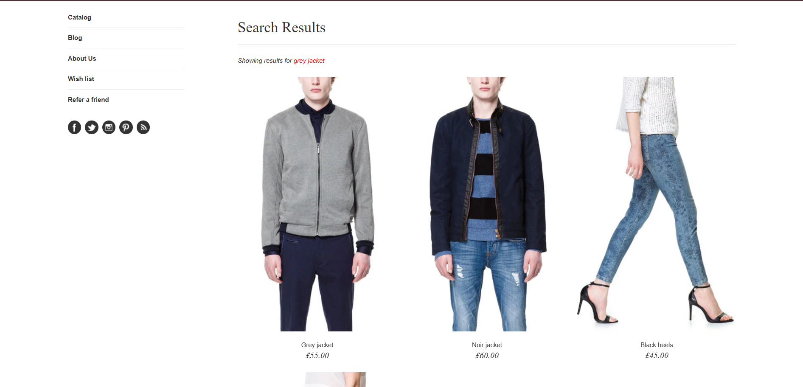

# BUG-002 - Search function does not filter search results

## Description
After searching an item, search results are not filtered. Instead, all products are displayed

## Steps to Reproduce
1. Navigate to the Search bar
2. Enter the name of an available item
3. Observe the application

## Expected Results
Only the matching products should be returned and displayed

## Actual Results
All the products are displayed

## Environment
- Browser: Google Chrome
- Operating System: Windows
- Application: SauceDemo

## Severity
- Low

## Priority
- Medium

## Status
- Open

## Evidence

